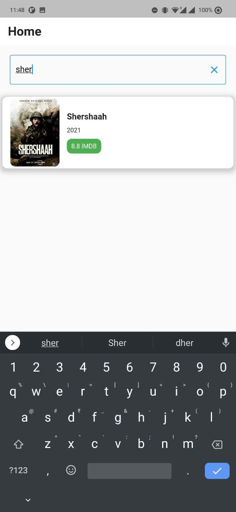

# Movie List App

The Application that lists the Movies name from IMDB api and search for the listed movies.

# Screenshots

# Steps
1. Clone this repository
2. Run the project

# API Used
https://imdb-api.com/en/API/MostPopularMovies/{Key}

# Library
http: ^0.13.3
## Getting Started

This project is a starting point for a Flutter application.

A few resources to get you started if this is your first Flutter project:

- [Lab: Write your first Flutter app](https://flutter.dev/docs/get-started/codelab)
- [Cookbook: Useful Flutter samples](https://flutter.dev/docs/cookbook)

For help getting started with Flutter, view our
[online documentation](https://flutter.dev/docs), which offers tutorials,
samples, guidance on mobile development, and a full API reference.
